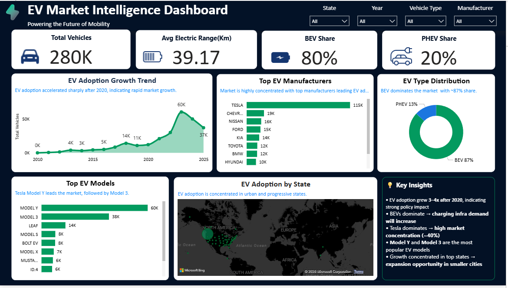

# ⚡ EVision Analytics  
### Electric Vehicle Market Intelligence | End-to-End Data Analytics Project

🚀 Built a scalable data analytics pipeline to analyze EV adoption trends, manufacturer dominance, and market behavior using real-world data.

---

## 📊 Key Highlights

- 📈 Analyzed **280,000+ EV records** to uncover market trends  
- ⚡ Identified **80% market shift toward BEVs**, signaling full electrification  
- 🏆 Discovered **Tesla as market leader (~40% share)**  
- 📍 Found **3–4x EV adoption growth post-2020**  

---

## 🏗️ End-to-End Pipeline
Raw Data → Python (ETL) → PostgreSQL → SQL Analytics → Power BI → Insights

---

## ⚙️ Tech Stack

- **Python (Pandas)** – Data Cleaning & Feature Engineering  
- **PostgreSQL** – Data Storage & Querying  
- **SQL** – Advanced Analytics (Joins, Window Functions, Ranking, YoY Growth)  
- **Power BI** – Interactive Dashboard & Data Storytelling  

---

## 📈 Dashboard Overview

The Power BI dashboard provides a comprehensive view of EV market trends through key KPIs and interactive visuals.

### 🔑 KPIs

- 🚗 **Total Vehicles:** 280K  
- 🔋 **Average Electric Range:** 39.17 km  
- ⚡ **BEV Share:** 80%  
- 🔌 **PHEV Share:** 20%  

---

## 📊 Key Insights

- EV adoption accelerated significantly after 2020, indicating rapid market expansion  
- Market is highly concentrated, with Tesla dominating EV production  
- BEVs dominate over PHEVs, showing a clear shift toward fully electric vehicles  
- EV adoption is geographically concentrated, highlighting infrastructure-driven growth  
- A few models (Model Y, Model 3) lead the market, indicating strong product-market fit  

---

## 📊 Dashboard Features

- EV Adoption Growth Trend (Year-wise)  
- Top EV Manufacturers & Market Share  
- BEV vs PHEV Distribution  
- Top EV Models  
- State-wise EV Adoption Map  
- Electric Range Segmentation  

---

## 📷 Dashboard Preview

---

## 🔄 ETL Workflow

- Extracted raw EV dataset using Python  
- Cleaned and transformed data (handled nulls, standardized formats, feature engineering)  
- Loaded processed data into PostgreSQL  
- Performed SQL-based aggregations and analysis  
- Built interactive Power BI dashboard for visualization  

---

## 🚀 Skills Demonstrated

✔ Data Cleaning & Preprocessing  
✔ SQL Data Analysis (Window Functions, Aggregations, Ranking)  
✔ Database Integration (PostgreSQL)  
✔ End-to-End Data Pipeline Development  
✔ Data Visualization & Business Storytelling  

---

## 📂 Project Structure

- 📓 [ev_data_cleaning.ipynb](./ev_data_cleaning.ipynb)  
  → Data cleaning & preprocessing using Pandas  

- 📊 [ev_etl_and_sql_analysis.ipynb](./ev_etl_and_sql_analysis.ipynb)  
  → ETL pipeline + exploratory data analysis  

- 🛢️ [ev_postgresql_queries.sql](./ev_postgresql_queries.sql)  
  → SQL queries for KPIs, aggregations, and insights  

- 📈 [Dashboard.pbix](./Dashboard.pbix)  
  → Power BI dashboard file  

- 🖼️ [dashboard_screenshot.png](./dashboard_screenshot.png)  
  → Dashboard preview  

- 📄 [README.md](./README.md)  
  → Project documentation  

---

## 📈 Business Impact

This project demonstrates the practical application of data analytics in solving real-world business problems:

- Identified **market concentration and competitive dominance**, enabling strategic benchmarking across EV manufacturers  
- Analyzed **EV adoption trends and growth acceleration post-2020**, supporting data-driven forecasting and policy insights  
- Evaluated the **shift from PHEV to BEV (~80% share)**, highlighting long-term industry direction toward full electrification  
- Uncovered **geographic adoption patterns**, revealing infrastructure-driven growth and expansion opportunities  

---

## 🚀 Learning & Growth

As my **first end-to-end data analytics project**, this experience helped me:

- Build a complete pipeline from **raw data → ETL → database → analytics → dashboard**  
- Apply **SQL (window functions, aggregations, ranking)** on real-world datasets  
- Develop **business thinking beyond coding**, focusing on insights and decision-making  
- Strengthen my ability to **translate data into impactful stories**

I am highly motivated to continue learning and contribute to real-world data problems as a **Data Analyst**.

---

## 👩‍💻 Author

**Seema Kumari**  
Data Analyst | Python • SQL • Power BI  

---

⭐ If you found this project useful, consider giving it a star!
