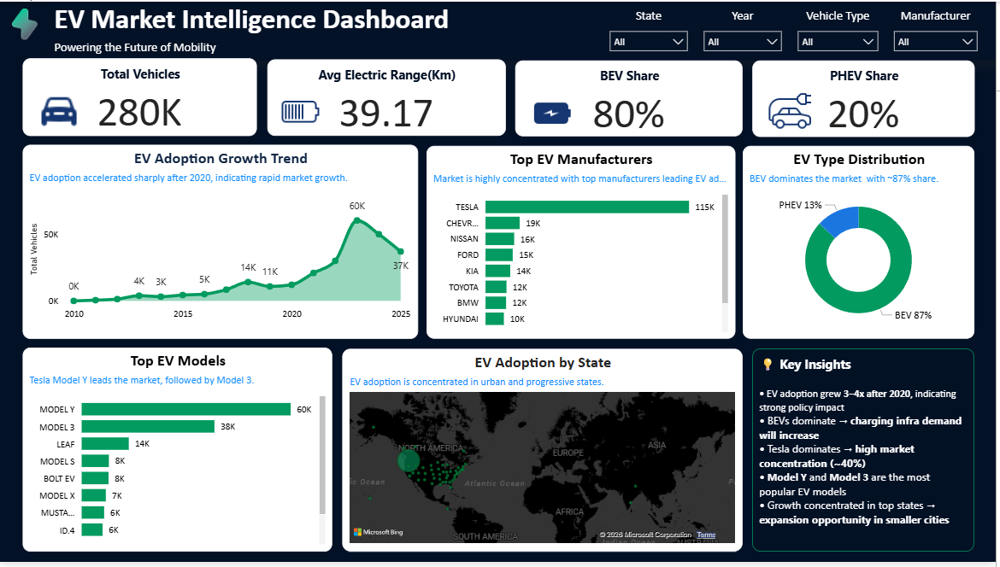

# ⚡ EVision — EV Market Intelligence


> **The real EV adoption bottleneck isn't demand — it's charging infrastructure.**  
> Proved with 279,780 real vehicle registrations across a full Python → PostgreSQL → Power BI pipeline.

---

## 📸 Dashboard



---

## 🏢 Business Problem

EV policy makers, investors, and automotive analysts are making billion-dollar decisions — fleet investments, infrastructure rollouts, incentive programs — without a clear picture of who is actually buying EVs, where, and what the real adoption curve looks like.

**The questions that needed answering:**
- Which manufacturers dominate — and is competition even possible?
- Has mass EV adoption actually started, or is it still niche?
- Is the market moving toward full BEV or staying on PHEV as a crutch?
- Where is the next wave of growth going to come from?
- What is the single biggest constraint on future adoption?

---

## 🗂️ Data

**Source:** Washington State DMV — Electric Vehicle Population Data (public dataset)  
**Volume:** 279,780 registered electric vehicles  

| Column | Description |
|--------|-------------|
| `Make`, `Model` | Manufacturer and model name |
| `Model Year` | Year of manufacture |
| `State`, `County`, `City` | Registration geography |
| `Electric Vehicle Type` | BEV or PHEV |
| `Electric Range` | Range in miles |
| `CAFV Eligibility` | Clean Alternative Fuel Vehicle status |

**Engineered columns added during cleaning:**

| Column | Logic | Why |
|--------|-------|-----|
| `ev_category` | Standardised from Electric Vehicle Type | Clean BEV / PHEV labels for grouping |
| `vehicle_age` | `2026 − Model Year` | Age-based fleet segmentation |
| `range_group` | Low / Medium / High thresholds | Range tier analysis across brands |

---

## 🏗️ Pipeline

```
Raw CSV — 279,780 rows
    ↓
Python · Pandas
  — null handling, type casting, deduplication
  — feature engineering: ev_category, vehicle_age, range_group
    ↓
PostgreSQL · SQLAlchemy + psycopg2
  — ETL load into structured table
  — indexed for query performance
    ↓
SQL Analysis
  — window functions: LAG, ROW_NUMBER, SUM OVER, PARTITION BY
  — market share, YoY growth, top models, range segmentation
    ↓
Power BI
  — KPI cards, trend line, bar charts, donut, map, slicers
  — State / Year / Vehicle Type / Manufacturer filters
```

---

## 📌 Key Metrics

| Metric | Value |
|--------|-------|
| Total registered EVs | **279,780** |
| BEV market share | **80%** |
| PHEV market share | **20%** |
| Tesla market share | **41%** (115K vehicles) |
| #2 manufacturer (Chevrolet) | **7%** (19K vehicles) |
| Model Y + Model 3 combined | **35% of entire market** |
| Average electric range | **39.17 miles** |
| Peak adoption year | **2023 — ~60K registrations** |
| Post-2020 growth | **3–4× surge** |

---

## 🔍 Insights

### 1 — Tesla isn't leading the market. It owns it.

Tesla's 41% share vs. Chevrolet's 7% is not a competitive lead — it is a **structural moat**. The gap between #1 and #2 is larger than Chevrolet's entire EV fleet. This is driven by Supercharger network density, OTA software updates, and ecosystem lock-in — not just product quality. Traditional OEMs are competing on hardware. Tesla competes on an integrated platform.

> **Implication:** The EV market is winner-take-most, not winner-take-all. New entrants need a differentiated ecosystem play, not just a better car.

---

### 2 — The post-2020 inflection is structural, not cyclical.

Registrations: ~11K (2019) → ~14K (2020) → ~60K (2023). A 3–4× surge in 3 years does not happen by accident. It aligns directly with the US Federal EV tax credit expansion, California ZEV mandates, and major automakers committing publicly to full electrification by 2030. This is policy-triggered acceleration that will compound forward — it will not revert to pre-2020 baseline.

> **Implication:** Demand is not the risk. Infrastructure is.

---

### 3 — 80% BEV makes charging infrastructure the #1 adoption constraint.

4 out of 5 registered EVs are fully battery-electric. PHEVs can fall back on petrol. BEVs cannot. At 80% BEV share, charging network density is now a **direct ceiling** on further adoption — especially in suburban and rural areas where home charging is not always an option.

> **Implication:** Every dollar invested in charging infrastructure unlocks more EV adoption than any additional manufacturer incentive.

---

### 4 — Two Tesla models outsell every other EV brand combined.

Model Y (60K) + Model 3 (38K) = 98K registrations. The entire Chevrolet + Nissan + Ford + KIA EV fleet combined = 64K. Two SKUs from one manufacturer beat four brands. Tesla's product strategy — fewer models, higher volume, deep ecosystem — is structurally outperforming the traditional multi-variant OEM approach.

> **Implication:** OEMs should consolidate to 2–3 flagship EV models rather than spreading R&D across 10+ variants.

---

### 5 — Average range of 39 miles masks a fleet in rapid transition.

The 39.17-mile average is pulled down by the large PHEV population (20–50 mile electric range) and older BEV models still in the registration pool. When segmented by range tier, the High Range (>250mi) tier — dominated by Tesla Model Y, Model 3, and newer BEVs — is growing fastest. The average actually understates how capable the current incoming fleet is.

> **Implication:** Range anxiety is a legacy concern. The incoming fleet has largely solved it. Charging speed and availability is the next UX frontier.

---

## 🧪 SQL Analysis

**Volume check & BEV/PHEV split**
```sql
SELECT COUNT(*) AS total_vehicles FROM ev_data;

SELECT ev_category, COUNT(*) AS total
FROM ev_data
GROUP BY ev_category;
```

**Market share — analytical window function**
```sql
SELECT
    "Make",
    COUNT(*) AS total,
    ROUND(COUNT(*) * 100.0 / SUM(COUNT(*)) OVER (), 2) AS market_share
FROM ev_data
GROUP BY "Make"
ORDER BY total DESC
LIMIT 10;
```

**Year-over-Year growth — LAG window function**
```sql
SELECT
    "Model Year",
    COUNT(*) AS total,
    LAG(COUNT(*)) OVER (ORDER BY "Model Year") AS prev_year,
    ROUND(
        (COUNT(*) - LAG(COUNT(*)) OVER (ORDER BY "Model Year")) * 100.0
        / LAG(COUNT(*)) OVER (ORDER BY "Model Year"), 2) AS yoy_growth
FROM ev_data
GROUP BY "Model Year"
ORDER BY "Model Year";
```

**Top 3 models per manufacturer — PARTITION BY**
```sql
SELECT * FROM (
    SELECT
        "Make", "Model", COUNT(*) AS total,
        ROW_NUMBER() OVER (PARTITION BY "Make" ORDER BY COUNT(*) DESC) AS rank
    FROM ev_data
    GROUP BY "Make", "Model"
) sub
WHERE rank <= 3
ORDER BY "Make", rank;
```

**Range segmentation — CASE classification**
```sql
SELECT
    CASE
        WHEN electric_range = 0 THEN 'No Range (PHEV/Unknown)'
        WHEN electric_range < 100 THEN 'Low Range'
        WHEN electric_range BETWEEN 100 AND 250 THEN 'Medium Range'
        ELSE 'High Range'
    END AS range_segment,
    COUNT(*) AS total
FROM ev_data
GROUP BY range_segment
ORDER BY total DESC;
```

**BEV vs PHEV % by year — PARTITION BY year**
```sql
SELECT
    "Model Year", ev_category,
    COUNT(*) AS total,
    ROUND(COUNT(*) * 100.0 / SUM(COUNT(*)) OVER (PARTITION BY "Model Year"), 2) AS pct
FROM ev_data
GROUP BY "Model Year", ev_category
ORDER BY "Model Year", ev_category;
```

---

## 🎯 Recommendations

| Priority | Recommendation | Based On |
|----------|---------------|----------|
| 🔴 Critical | Invest immediately in fast-charging infrastructure in top EV states | BEV = 80% — charging is the adoption ceiling, not demand |
| 🟠 High | Target suburban + smaller cities for next-wave EV incentive programs | Urban concentration confirmed — whitespace identified in data |
| 🟠 High | OEMs: consolidate to 2–3 flagship EV models, stop proliferating variants | Tesla 2-model strategy outperforms all multi-SKU OEM approaches |
| 🟡 Medium | Extend CAFV incentives to Medium-range BEVs (100–250mi) | Largest addressable segment by volume — currently underserved |
| 🟢 Ongoing | Track BEV vs PHEV ratio per brand year-over-year | Wide variation across OEMs in electrification commitment and pace |

---

## ⚠️ Caveats

- **Washington State only** — one of the most EV-progressive US states. National numbers would show lower BEV share and slower adoption. Do not extrapolate directly.
- **2024–2025 apparent decline** — data completeness issue, not a real market slowdown. Newer registrations not fully captured yet.
- **39-mile average is PHEV-weighted** — pure BEV average range is significantly higher.
- **No pricing data** — premium vs. mass-market segmentation inferred from brand positioning, not transaction price.

---

## 🛠️ Tools

| Tool | Purpose |
|------|---------|
| Python (Pandas) | Ingestion, cleaning, null handling, feature engineering |
| PostgreSQL | ETL destination, SQL analysis layer |
| SQLAlchemy + psycopg2 | Python → PostgreSQL connection and load |
| SQL Window Functions | `LAG`, `ROW_NUMBER`, `PARTITION BY`, `SUM OVER` |
| Power BI Desktop | Interactive dashboard — KPI cards, charts, map, slicers |
| Jupyter Notebook | End-to-end documented analysis workflow |

---

## 📁 Repository

```
ev-market-intelligence/
├── 📊 Dashboard.pbix                  ← Power BI dashboard
├── 📄 EVision_Analytics.pdf           ← PDF dashboard export
├── 🖼️ dashboard_screenshot.png        ← dashboard preview
├── 🐍 ev_data_cleaning.ipynb          ← cleaning & feature engineering
├── 🐍 ev_etl_and_sql_analysis.ipynb   ← ETL pipeline + SQL analysis
├── 🗄️ ev_postgresql_queries.sql       ← all standalone SQL queries
└── README.md
```

---

## 🤝 Connect

[](https://www.linkedin.com/in/seema-kumari-375763308/)
[](mailto:seemakri136@gmail.com)
[](https://github.com/seema-kri)

---

*Full analyst stack — Python for cleaning, PostgreSQL for analysis, Power BI for storytelling — applied to 279K real-world EV registrations from Washington State DMV.*
